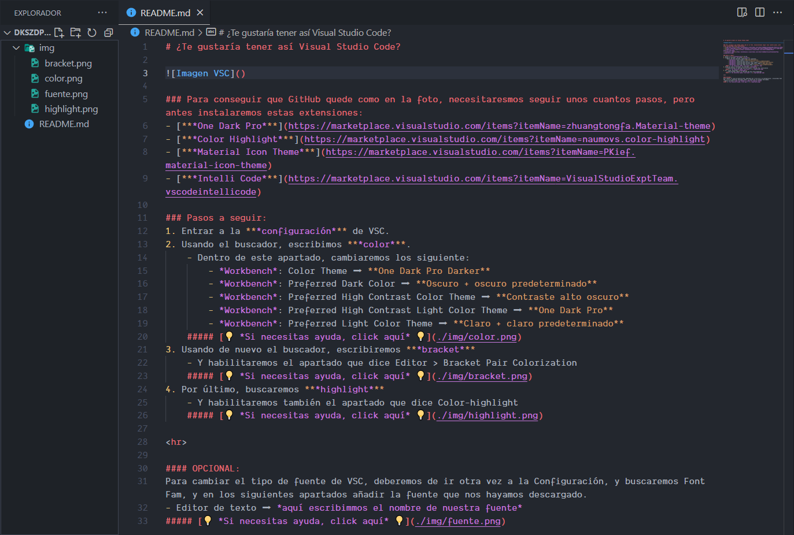

    
    <h1 align="center">Visual Studio Code</h1>
    
👨‍🏫 Tutorial de Configuración 👨‍🏫

    
    

# ¿Te gustaría tener así Visual Studio Code?

### Para conseguir que GitHub quede como en la foto, necesitaresmos seguir unos cuantos pasos, pero antes instalaremos estas extensiones:
- [***One Dark Pro***](https://marketplace.visualstudio.com/items?itemName=zhuangtongfa.Material-theme)
- [***Color Highlight***](https://marketplace.visualstudio.com/items?itemName=naumovs.color-highlight)
- [***Material Icon Theme***](https://marketplace.visualstudio.com/items?itemName=PKief.material-icon-theme)
- [***Intelli Code***](https://marketplace.visualstudio.com/items?itemName=VisualStudioExptTeam.vscodeintellicode)

### Pasos a seguir:  
1. Entrar a la ***configuración*** de VSC.
2. Usando el buscador, escribimos ***color***.  
    - Dentro de este apartado, cambiaremos los siguiente:
        - *Workbench*: Color Theme ➡ **One Dark Pro Darker**
        - *Workbench*: Preferred Dark Color ➡ **Oscuro + oscuro predeterminado**
        - *Workbench*: Preferred High Contrast Color Theme ➡ **Contraste alto oscuro**
        - *Workbench*: Preferred High Contrast Light Color Theme ➡ **One Dark Pro**
        - *Workbench*: Preferred Light Color Theme ➡ **Claro + claro predeterminado**  
    ##### [💡 *Si necesitas ayuda, click aquí* 💡](./img/color.png)
3. Usando de nuevo el buscador, escribiremos ***bracket***
    - Y habilitaremos el apartado que dice Editor > Bracket Pair Colorization  
    ##### [💡 *Si necesitas ayuda, click aquí* 💡](./img/bracket.png)
4. Por último, buscaremos ***highlight***
    - Y habilitaremos también el apartado que dice Color-highlight  
    ##### [💡 *Si necesitas ayuda, click aquí* 💡](./img/highlight.png)

#### OPCIONAL:
Para cambiar el tipo de fuente de VSC, deberemos de ir otra vez a la Configuración, y buscaremos Font Fam, y en los siguientes apartados añadir la fuente que nos hayamos descargado.
- Editor de texto ➡ *aquí escribimmos el nombre de nuestra fuente*  
##### [💡 *Si necesitas ayuda, click aquí* 💡](./img/fuente.png)

(<a href="#top">volver arriba</a>)
